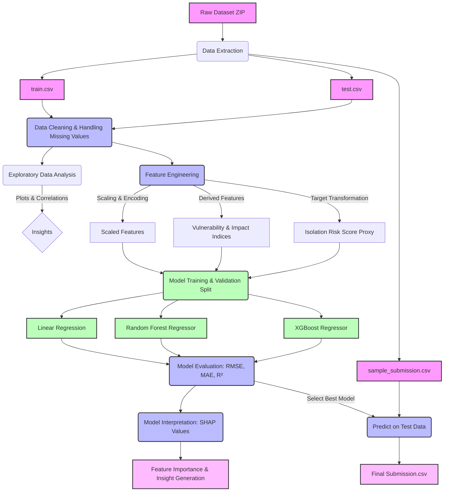

# Community Isolation Risk Prediction Architecture

This document outlines the high-level system architecture and data flow for the Community Isolation Risk modeling pipeline.

## System Architecture Diagram

### Component Details
1. **Data Inputs:** Raw uploaded ZIP dataset containing `train.csv`, `test.csv`, and `sample_submission.csv`.
2. **Preprocessing:** Handling missing values, cleaning outliers, and preparing data.
3. **Exploratory Data Analysis (EDA):** Visualizing distributions, calculating feature correlation matrices to identify initial feature importance.
4. **Feature Engineering:** Scaling numerical fields, encoding categorical variables, deriving vulnerability and weather impact indices, and generating an 'Isolation Risk Score' proxy from 'FloodProbability' target.
5. **Modeling:** A split validation approach to train and compare baseline Linear Regression, Random Forest, and Gradient Boosting (XGBoost).
6. **Model Evaluation:** Computing regression metrics: RMSE, MAE, R².
7. **Interpretation:** Utilizing SHAP values on the best model to provide explainability for the drivers of community isolation risk.
8. **Prediction & Submission:** Generating final Isolation Risk predictions for the test set and structuring the output based on `sample_submission.csv`.
